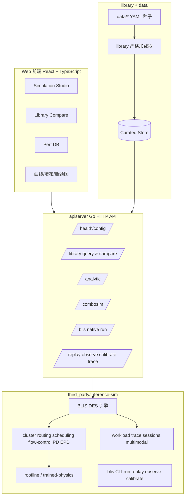

# 架构设计文档（Architecture）

> 状态：草拟中（v0.2）。本文件与 `docs/requirements.md` 对齐，作为持续更新文档维护；
> 变更见文末“变更记录”。
> 关联：`docs/requirements.md`（需求）、`docs/UPSTREAM-DELTAS.md`（基座同步）、`docs/issues/`。

## 1. 设计目标与约束

本项目围绕 `docs/requirements.md` 中定义的六类核心能力展开设计：

1. 可视化界面（配置编辑、结果查看、对比分析）
2. 四大参考库（模型 / 硬件 / 推理框架 / 应用场景）
3. 解析性能模型（TTFT / TPOT / roofline / 分段瓶颈）
4. 公开性能数据库（含测试条件与出处）
5. 优化手段可控的组合仿真系统
6. BLIS 原生命令与高级 serving 能力的 Web 复用（run / replay / observe / calibrate / trace / flow-control / PD / EPD / autoscaler / saturation）

在此基础上，架构必须同时满足以下硬约束：

- **基座可独立同步**：BLIS 基座与扩展代码物理隔离，可独立从上游 `inference-sim` 同步。
- **扩展零侵入**：平台功能通过新模块/新目录叠加，不改基座 `cmd/`、`sim/` 主体。
- **数据严格治理**：参考库数据必须带 schema/version/provenance，并严格解析。
- **先垂直切片后横向扩展**：首期优先落地 Ascend + Qwen，再泛化到更多模型/硬件/框架。

## 2. 总体架构

项目采用“双模块 + 分层服务”的总体架构：



对应关系：

- **UI 层**：承载需求中的配置、查询、对比、动态图表与瓶颈可视化，并逐步承接 BLIS 原生 run/replay/observe/calibrate 入口。
- **API 层**：统一提供库查询、解析建模、性能数据库查询、组合仿真，以及 BLIS native simulation 等服务。
- **数据层**：用 `library/` + `data/` 管理四大参考库、性能数据库和优化手段目录。
- **基座层**：复用 BLIS 的离散事件仿真、workload synthesis、trace pipeline、routing/scheduling/flow-control/PD/EPD/autoscaler/saturation 能力，避免重复造轮子。

## 3. 目录与模块划分

### 3.1 根扩展模块

根目录是扩展模块 `github.com/DanielKernel/inference-sim-platform`，负责新增平台能力：

```text
apiserver/   独立 Go HTTP API
library/     数据 schema + 严格 YAML 加载器
data/        curated 数据种子
web/         React + TypeScript 前端
docs/        需求/架构/issues/同步说明
scripts/     同步与辅助脚本
```

后续按阶段补充（逻辑上），当前部分能力已经以内聚文件形式先落在 `apiserver/`：

```text
analytic/    解析性能模型（当前已先落在 `apiserver/analytic.go`）
combosim/    优化手段组合仿真（当前已先落在 `apiserver/simulate.go`）
ascend/      Ascend 专用保真建模
blisnative/  BLIS 原生命令与 cluster DES 适配层（当前已先落在 `apiserver/blis.go`）
```

### 3.2 基座模块

BLIS 基座位于：

```text
third_party/inference-sim/
```

它保持原始 Go 模块身份：

```go
module github.com/inference-sim/inference-sim
```

根模块通过本地 `replace` 依赖它：

```go
replace github.com/inference-sim/inference-sim => ./third_party/inference-sim
```

这保证：

- 平台扩展与基座代码不混放；
- 基座可以整体替换升级；
- 平台后续可以直接导入基座 `sim/...` 能力。

## 4. 分层职责

### 4.1 前端层（Web UI）

对应需求 4.1、4.2、4.3、4.4、4.5、4.8：

- 配置模型、硬件、输入输出长度、框架、优化手段；
- 浏览/筛选四大参考库；
- 查看曲线、瓶颈、对比结果；
- 查看性能数据库中的公开数据及测试条件。
- 通过一键脚本启动后，直接在浏览器中完成配置、仿真与结果查看。

当前技术选型：

- React 18
- TypeScript
- Vite
- react-router
- recharts

### 4.2 API 层（apiserver）

API 层是平台对外统一入口，职责包括：

- 返回健康状态与平台配置；
- 暴露四大参考库 / 性能数据库的查询接口；
- 提供解析模型接口；
- 提供平台组合仿真与对比接口；
- 提供 BLIS native run 入口，并为 replay / observe / calibrate 预留统一接入点。

当前代码已经落地的接口：

- `GET /api/health`
- `GET /api/config`
- `GET /api/library/{kind}`（过滤）
- `POST /api/library/{kind}/compare`
- `POST /api/analytic/estimate`
- `POST /api/combosim/simulate`
- `POST /api/blis/simulate`

目标演进：

| 能力域 | 当前接口 / 代码落点 | 对应需求 |
|------|----------------------|----------|
| Reference data | `server.go` + `library_query.go` | 四大参考库查询与对比 |
| Analytic model | `analytic.go` + `estimate.go` | 解析性能模型 |
| Perf DB | `GET /api/library/perf_records` + `web/src/pages/PerfDatabasePage.tsx` | 公开性能数据库 |
| Platform combosim | `simulate.go` | 最差/最佳/典型 + 手工优化手段 |
| BLIS native run | `blis.go` | 原生 cluster DES 运行 |
| Replay / Observe / Calibrate | **基座已有，平台未接入**（`cmd/replay.go`、`cmd/observe_cmd.go`、`cmd/calibrate.go`） | Trace pipeline、实测校准 |

### 4.3 数据层（library + data）

数据层负责承载“库”和“公开数据”的事实来源。

#### 六类数据对象

1. `Model`
2. `Hardware`
3. `Framework`
4. `Scenario`
5. `PerfRecord`
6. `Optimization`

为承接 BLIS native run，`Hardware` 还额外带 `calibration` 字段（MFU 与状态），供平台构造
`sim.HardwareCalib`。

#### 数据文件信封

每个 YAML 文件统一使用：

```yaml
schema_version: 1
kind: model
provenance:
  source: ...
  url: ...
  retrieved: 2026-06-19
items:
  - ...
```

设计目的：

- 支撑长期维护与增量扩展；
- 强制记录出处，满足“公开数据可回溯”要求；
- 避免字段漂移与隐性兼容问题。

### 4.4 仿真与建模层

这一层对应需求 4.6、4.7、4.8，是平台的核心计算层：

- **解析模型**：根据模型、硬件、输入输出长度推导 TTFT/TPOT、ridge point、瓶颈边界。
- **性能数据库查询**：根据组合条件查询公开测试结果。
- **组合仿真**：自动/手动选择优化手段，输出最差/最佳/典型结果并附加解释。
- **全流程分段**：对单次结果做 QKV / Attention / FFN / KV / Comm / Sampling 等消耗分解。
- **运行时维度建模**：支持 runtime version / CANN version / graph mode / quant mode / comm mode 等参数进入仿真输入。
- **BLIS native run 适配**：把 curated Model / Hardware 转换为 `sim.ModelConfig` / `sim.HardwareCalib`，
  直接调用 `sim/cluster` + `sim/workload` + `sim/latency` 运行真实 DES。
- **Trace pipeline 适配（目标）**：把 `cmd/replay.go`、`cmd/observe_cmd.go`、`cmd/calibrate.go` 所代表的
  TraceV2 与校准闭环做成 Web 能力，而不是停留在 CLI。

其中：

- Phase 2 偏**解析建模**；
- Phase 3 偏**事实数据查询**；
- Phase 4 偏**规则 + 解析 + 仿真融合**。

### 4.5 基座层（BLIS）

BLIS 基座继续负责：

- 离散事件仿真（DES）
- 请求/队列/调度/批处理/路由等 serving 语义
- 现有 roofline 与 trained-physics 延迟模型
- workload synthesis / TraceV2 / session / multimodal 生成
- replay / observe / calibrate 数据闭环
- flow control、goodput、post-hoc saturation、PD / EPD、autoscaler 等高级机制

平台对基座的使用策略是：

- **能复用就复用**；
- **不能直接复用的能力在根模块新增**；
- **不把平台需求反向灌入基座源码**。

### 4.6 BLIS 能力映射到平台（新增）

| BLIS 能力 | 代码证据 | 平台当前状态 | Web 目标 |
|----------|----------|-------------|----------|
| Run / cluster DES | `third_party/inference-sim/cmd/root.go`、`sim/cluster/cluster.go`、`sim/cluster/deployment.go` | 已通过 `apiserver/blis.go` 接入首版 | 继续扩充参数面板 |
| Replay | `third_party/inference-sim/cmd/replay.go` | 未接入 | 增加 Trace 导入与回放页 |
| Observe | `third_party/inference-sim/cmd/observe_cmd.go` | 未接入 | 增加真实服务采集页 |
| Calibrate | `third_party/inference-sim/cmd/calibrate.go`、`sim/workload/calibrate.go` | 未接入 | 增加校准报告页 |
| Workload synthesis | `sim/workload/spec.go`、`sim/workload/generator.go` | 仅用到常量长度 + 基础 arrival 首版 | 接入 cohort / concurrency / multimodal / reasoning / multi-turn |
| TraceV2 | `sim/workload/tracev2.go` | 未接入 | 导入 / 导出 / 追踪结果 |
| Flow control | `sim/cluster/flow_control_admission.go`、`sim/cluster/gateway_queue.go` | 未接入 | 增加 gateway flow control 面板 |
| PD / EPD | `sim/cluster/pd_events.go`、`sim/cluster/deployment.go` | 未接入 | 增加 prefill / decode / encode 池配置 |
| Autoscaler | `sim/cluster/autoscaler.go` | 未接入 | 增加 autoscaler 配置与可视化 |
| Saturation / Goodput | `sim/metrics.go`、`sim/saturation/*.go`、`cmd/goodput.go` | 未接入 | 增加稳定性 / 好吞吐分析页 |

## 5. 关键架构决策

### 5.1 为什么采用双模块

这是为了同时满足两类目标：

1. **工程隔离**：扩展平台代码和 BLIS 基座代码彻底解耦；
2. **同步便利**：基座可以独立升级，不影响根目录新增平台逻辑。

如果继续把平台代码直接混在 BLIS 根目录中，会导致：

- 上游同步冲突面不断扩大；
- CI / docs / issue / web / data 与基座逻辑边界不清；
- 架构演进与基座升级强耦合。

### 5.2 为什么不用 `vendor/`

Go 把 `vendor/` 作为依赖 vendoring 保留目录。若把基座放进真正的 `vendor/`，会触发 Go 的
vendoring 机制，容易导致 `go build` / IDE / CI 异常。因此采用：

```text
third_party/inference-sim/
```

来表达“受管第三方基座”。

### 5.3 为什么前端与 API 分离

前端承担大量交互、配置与图表职责，若全部放到服务端模板中：

- 图表与对比交互复杂度高；
- 前后端职责会混杂；
- 不利于后续增加动态曲线与多视图联动。

因此采用 React + TS 前端，Go 只负责 API 与计算。

### 5.4 为什么要求“BLIS 全量复用”进入 Web

仅把平台自定义 heuristic combosim 暴露给 Web，会形成两套能力边界：

- CLI 可做 replay / observe / calibrate / flow-control / PD / saturation；
- Web 只能做参考库浏览、简化组合仿真和首版原生 run。

因此架构上必须把 BLIS 基座视为**正式产品能力源**，而不是后台库：Web 应逐步成为 CLI 之上的统一控制面。

## 6. 与 requirements 的逐项对齐

| requirements.md 需求 | 架构承载位置 |
|----------------------|-------------|
| 可视化界面 | `web/` + `apiserver/` |
| 模型库 | `data/models/` + `library/` + Phase 1 API/UI |
| 硬件库 + roofline | `data/hardware/` + `library/` + `analytic/` |
| 框架/优化手段库 | `data/frameworks/` + `data/optimizations/` + `library/` |
| 应用场景库 | `data/scenarios/` + `library/` |
| 解析性能模型 | `analytic/` + 基座 `sim/latency/` |
| 性能数据库 | `data/perfdb/` + `/api/perfdb/*` |
| 组合仿真系统 | `combosim/` + `/api/combosim/*` + `web/` |
| BLIS 原生命令与高级 serving 机制 | `third_party/inference-sim/cmd/*` + `third_party/inference-sim/sim/*` + `apiserver/blis.go` |
| 基座独立同步 | `third_party/inference-sim/` + `scripts/update-base.sh` |

## 7. 演进路线

### Phase 0（已完成）

- 双模块拆分
- `library/` schema + loader
- `apiserver/` 骨架
- `web/` 骨架
- CI 与基座同步工具
- requirements / architecture / issues 文档

### Phase 1

- 四大参考库的过滤、查询、对比 API
- 更丰富的前端列表、详情、对比页面

### Phase 2

- `analytic/`：公式、ridge point、曲线、分段、动态图

### Phase 3

- `perfdb`：公开性能数据查询与出处展示

### Phase 4

- `combosim/`：最差/最佳/典型仿真、手段清单化、手工选择、同/异组合对比

### Phase 5

- `ascend/`：Ascend 保真建模（graph/eager、HCCS、KV Int8、Qwen thinking / MLA / VL）

### Phase 6

- 把 BLIS 的 replay / observe / calibrate / trace / flow-control / PD / EPD / autoscaler / saturation 全量接入 Web
- 让 Web 成为 inference-sim 的统一控制面，而不是仅覆盖平台 overlay 能力

## 8. 同步与运维

### 8.1 基座同步

基座不同步方式不是根目录 `git merge upstream/main`，而是：

```bash
scripts/update-base.sh
```

它会把上游指定 ref 覆盖到：

```text
third_party/inference-sim/
```

因此：

- 平台扩展目录不会受影响；
- fork 关系不是必须条件；
- 可以安全脱离 GitHub fork 关系，只保留 URL 级同步能力。

### 8.2 CI

根目录生效工作流：

- `platform.yml`：扩展模块 + 前端
- `base-ci.yml`：基座模块
- `base-drift-check.yml`：基座漂移检查

### 8.3 一键构建与运行

根目录提供：

- `scripts/build-platform.sh`：一键构建 Go API 与 Web 静态页面；
- `scripts/run-platform.sh`：一键构建、启动统一服务、健康检查、自动打开浏览器。
- `scripts/build-platform.ps1` / `scripts/run-platform.ps1`：Windows PowerShell 原生入口。
- `scripts/build-platform.cmd` / `scripts/run-platform.cmd`：Windows CMD / 双击包装入口。

运行后由 `apiserver` 同时托管：

- `/api/*` 后端接口
- `web/dist` 构建后的前端页面

操作系统覆盖：

- **Ubuntu**：`*.sh`
- **macOS**：`*.sh`
- **Windows**：`*.ps1` 或 `*.cmd`

## 9. 当前差距与后续补齐点

当前架构已经覆盖需求文档的总体方向，但仍有待补齐：

- Replay / Observe / Calibrate 尚未成为 Web 工作台的一部分；
- flow control、PD / EPD、autoscaler、saturation、goodput 仍主要停留在 CLI / 基座层；
- `perfdb` 目前仍以少量公开种子数据为主，真实公开组合覆盖度仍需在 Phase 3 强化；
- 当前 `apiserver/` 已先承担 `analytic / combosim / blisnative` 逻辑，后续可再按模块边界拆分为独立目录；
- 需要在 issue 体系中持续把 BLIS 全量复用拆到更细的执行单元。

## 变更记录

| 版本 | 日期 | 变更 |
|------|------|------|
| v0.3 | 2026-06-19 | 明确把 `third_party/inference-sim` 的 run/replay/observe/calibrate、workload、trace、flow-control、PD/EPD、autoscaler、saturation 等能力纳入架构范围，并新增平台-基座能力映射。 |
| v0.2 | 2026-06-19 | 收敛为 `docs/architecture.md` 单文件；补齐与 `requirements.md` 的逐项对齐、总体架构、关键架构决策、演进路线与同步机制。 |
| v0.1 | 2026-06-19 | 初稿：双模块架构、数据模型、API 演进、解析/仿真复用基座、基座隔离与同步、CI。 |
